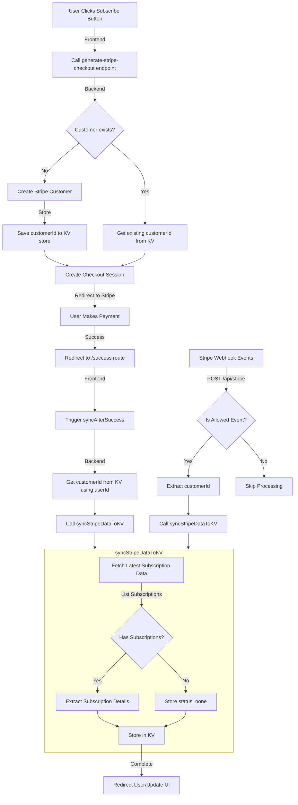

# Stripe Service

A clean, modular implementation of Stripe billing with a focus on reliability and consistency. This service simplifies subscription management by centralizing all Stripe data synchronization.

## Key Features

- **Single Source of Truth**: All subscription state is synced from Stripe to a KV store to prevent state inconsistencies
- **Reliable Webhook Handling**: Processes only relevant webhook events with detailed logging
- **Session-First Approach**: Always creates a customer before checkout to ensure reliable user identification
- **Clean API**: Provides clear interfaces for checkout, subscriptions, and billing operations
- **No Side Effects**: Each component creates its own Stripe client, avoiding global state

## Quick Start

1. Set up your environment variables:

```env
STRIPE_SECRET_KEY=sk_test_your_test_key
STRIPE_PUBLISHABLE_KEY=pk_test_your_test_key
STRIPE_WEBHOOK_SECRET=whsec_your_webhook_secret
STRIPE_PRICE_ID=price_1234567890
```

2. Initialize the service:

```typescript
import { kv } from '../services/key-value'; // Your KV service implementation
import { logger } from '../services/logging'; // Your logger implementation
import { StripeService } from '../services/stripe';
import { StripeKVStore } from '../services/stripe/kv-store';

const store = new StripeKVStore(kv);

const stripe = new Stripe(process.env.STRIPE_SECRET_KEY, {
  apiVersion: '2025-02-24.acacia',
});

// Create the Stripe service instance
const stripeService = new StripeService(store, stripe, {
  logger,
  baseUrl: 'https://yourdomain.com',
  successPath: '/billing/success',
  cancelPath: '/billing',
  webhookSecret: process.env.STRIPE_WEBHOOK_SECRET!,
  secretKey: process.env.STRIPE_SECRET_KEY!,
});
```

3. Create a checkout session:

```typescript
const checkoutSession = await stripeService.createSubscriptionCheckout(
  user.id,
  user.email,
  process.env.STRIPE_PRICE_ID!, // Your price ID
);

// Redirect to checkout URL
return redirect(checkoutSession.url);
```

4. Set up webhook handler:

```typescript
// In your webhook handler route
const body = await request.text();
const signature = headers.get('stripe-signature');

const result = await stripeService.handleWebhook(body, signature);

if (!result.received) {
  return new Response(result.error, { status: 400 });
}

return new Response(JSON.stringify({ received: true }), {
  status: 200,
  headers: {
    'Content-Type': 'application/json',
  },
});
```

5. Check subscription status:

```typescript
const isSubscribed = await stripeService.hasActiveSubscription(user.id);

if (!isSubscribed) {
  // Handle non-subscribed user
}
```

## Implementation Guide

For detailed implementation instructions and API routes, see:

1. Create API route handlers in `app/api/stripe/...` to expose checkout, webhooks, and subscription management
2. Use the service in your application logic to check subscription status and control access to features

## Design Philosophy

This implementation follows Theo's "How I Stay Sane Implementing Stripe" approach with additional improvements:

- Always create the customer BEFORE starting checkout
- A single `syncStripeData` function keeps data consistent
- Clean webhook handling focusing only on relevant events
- KV store as an efficient caching layer for subscription state

## Tips

**Enable "Limit customers to one subscription"** This is the ONLY way to prevent someone from being able to check out twice if they open up two checkout sessions [Stripe Docs](https://docs.stripe.com/payments/checkout/limit-subscriptions)

## Credit

[Theo's Stripe Recommendations](https://github.com/t3dotgg/stripe-recommendations/blob/main/README.md)

## Flow Diagram


